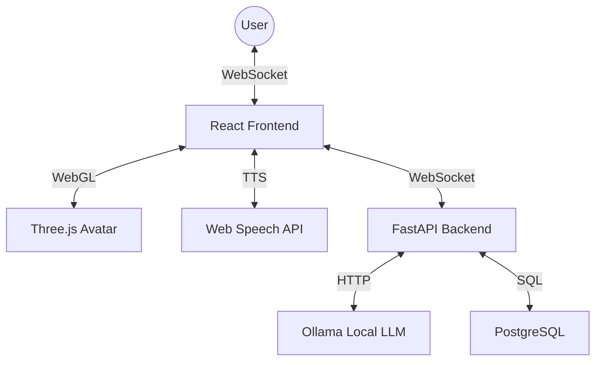

# Enterprise Digital Concierge (EDC) System

An enterprise-grade, real-time interactive 3D humanoid assistant powered by local AI and WebSockets.


## 🎥 Overview

The EDC System provides a premium user experience where a 3D avatar interacts with users in real-time. It features low-latency AI responses, automated lip-syncing, and voice synthesis, all running in a containerized environment.

### Key Features

- **👤 3D Avatar**: Realistic 3D model with "ARKit" facial blendshapes.
- **👄 Automated Lip-Sync**: Real-time mouth movements synchronized with voice output.
- **⚡ Zero-Delay Voice**: Streaming TTS (Text-to-Speech) that starts speaking before the AI finishes thinking.
- **🤖 Local AI (Ollama)**: Highly secure and private conversational AI using the Gemma/Llama models.
- **✨ Glassmorphic UI**: High-end modern design using Tailwind CSS.
- **📦 Full Stack Docker**: One-command deployment for the entire system.

## 🏗️ System Architecture



## 🚀 Getting Started

### Prerequisites

- [Docker & Docker Compose](https://www.docker.com/)
- [Ollama](https://ollama.ai/) (Running locally on `http://localhost:11434`)
  - Pull the model: `ollama pull gemma`

### Installation

1. **Clone the repository**:

   ```bash
   git clone https://github.com/your-username/edc-system.git
   cd edc-system
   ```

2. **Run with Docker Compose**:

   ```bash
   docker-compose up -d
   ```

3. **Access the application**:
   - Frontend: [http://localhost:3000](http://localhost:3000)
   - Backend API: [http://localhost:8000/docs](http://localhost:8000/docs)

### Local Development (Manual)

If you prefer running without Docker:

- **Backend**: `cd backend && pip install -r requirements.txt && uvicorn app.main:app --reload`
- **Frontend**: `cd frontend && npm install && npm run dev`

## 🛠️ Technology Stack

- **Frontend**: React 18, TypeScript, Three.js (@react-three/fiber), Tailwind CSS.
- **Backend**: Python 3.10+, FastAPI, SQLAlchemy, Pydantic.
- **Database**: PostgreSQL (Via Docker).
- **Communication**: WebSockets (Real-time Full Duplex).
- **Voice**: Web Speech API.

## 📁 Project Structure

- `/frontend`: React source code and 3D assets.
- `/backend`: FastAPI application and AI pipeline.
- `/database`: Initial SQL schema.
- `/docs`: Detailed project proposals and technical documentation.

---
Created with ❤️ by Antigravity AI
